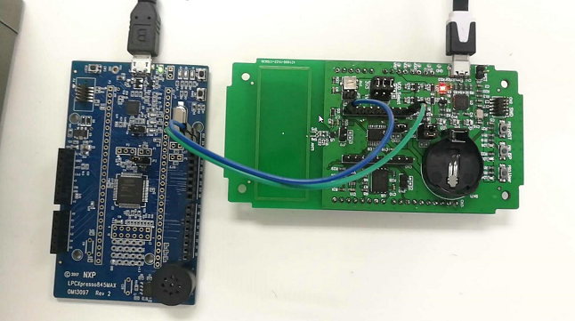

# NXP Application Code Hub

## AN12126: Using LPC802 as I/O Expander
This application note introduces how to use LPC802 as I/O expander via the I2C-bus interface.

Please refer to AN12126 for complete instructions on how to use this software.
https://www.nxp.com/docs/en/application-note/AN12126.pdf

LPC802 is a new member of the LPC800 series, which satisfies the demand for 
improved power efficiency. It is an ideal product for the migration of market from 8-bit 
architecture with a very low cost. LPC802 has up to 15 MHz Cortex-M0+ core with 16 kB 
flash and 2 kB RAM. It is suitable for I/O expander, small programmable logic unit, etc. 
This application note discusses about LPC802 as an I/O expander. 
As LPC802 uses ARM® Cortex®-M0+ core, it can perform single-cycle I/O toggle 
operation. It is suitable to use LPC802 as an I/O expander. Such kind of devices are 
widely used in:

- Factory automation and process control
- Portable and battery operated devices
- Cellular data devices

#### Boards: LPCXpresso802
#### Categories: Industrial
#### Peripherals: UART, GPIO, FLASH
#### Toolchains: MDK

## Table of Contents
1. [Software](#step1)
2. [Hardware](#step2)
3. [Setup](#step3)
4. [Results](#step4)
5. [FAQs](#step5) 
6. [Support](#step6)
7. [Release Notes](#step7)

## 1. Software
* LPC802 Example Code Bundle KEIL Rev 1.5 Aug 8, 2018
* LPC845 Example Code Bundle (KEIL) Rev 1.2 Dec 19, 2017

The software for this Application Note is delivered in raw source files and MDK projects.

When opening Keil project, there may will be some missing file in \Source_Code\common\ folder, those are NXP Code Bundles library files, due to license issue, user should download those file from [here](https://www.nxp.com/products/processors-and-microcontrollers/arm-microcontrollers/general-purpose-mcus/lpc800-arm-cortex-m0-plus-/code-bundles-for-lpc800-family-devices:LPC800-CODE-BUNDLES) can paste the related library(startup) file to  \Source_Code\common\ folder.

## 2. Hardware
- Master: LPCXpresso845MAX(OM13097) board Rev A

  -- I2C_SDA: P0_11
  -- I2C_SCL: P0_10

- Slave: LPCXpresso802(OM40000) board, Rev A

  -- I2C_SDA: P0_10
  -- I2C_SCL: P0_16

  A low power LED connected between PIO0_1 and GND to see the test result 

## 3. Setup

 Download firmware to each board

 - For master demo project (LPC845): compile project under 
“\lpc845_io_expander_master\Keil_Projects” and download image into LPC845 board.

- For slave firmware project (LPC802), compile project under 
“lpc802_io_expander_slave\Project\Internal\LPC802\mdk” and download image into LPC802 board.

## 4. Results
The LPC845 will set pin direction register to 0XFF (all pins output) and writes 0X00 in pin status register for ~500 ms and then 0XFF for the next ~500 ms. It means that pin 0 to pin 7 will toggle at 1 Hz, which makes the LED connected to P0_1 to blink at 1 Hz.
## 5. FAQs

## 6. Support
#### Project Metadata
<!----- Boards ----->

<!----- Categories ----->

<!----- Peripherals ----->
  

<!----- Toolchains ----->

Questions regarding the content/correctness of this example can be entered as Issues within this GitHub repository.

>**Warning**: For more general technical questions regarding NXP Microcontrollers and the difference in expected funcionality, enter your questions on the [NXP Community Forum](https://community.nxp.com/)

## 7. Release Notes
| Version | Description / Update                           | Date                        |
|:-------:|------------------------------------------------|----------------------------:|
| 1.0     | Initial release on Application Code HUb        | June 7th 2023 |

